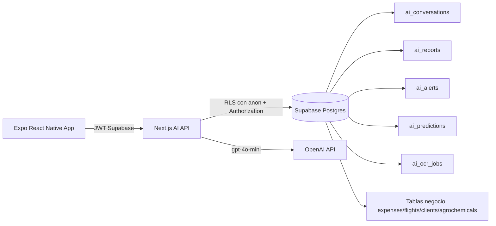

# AgroNex AI Platform

## Arquitectura General



## Estructura de carpetas

```text
supabase/
  ai_schema.sql

apps/agronex-ai-api/
  src/lib/supabase/
  src/lib/openai/
  src/lib/ai/
  src/lib/auth/
  src/app/api/ai/
    chat/
    reports/
    anomalies/
    predictions/
    ocr/
    dashboard/
  src/app/api/health/

src/
  services/aiPlatformClient.ts
  services/aiPlatformTypes.ts
  hooks/useAgroChat.ts
  hooks/useAiDashboard.ts
  hooks/useAiReports.ts
  components/ai/
  screens/AgroChatScreen.tsx
  screens/IntelligentReportsScreen.tsx
  screens/OcrExpenseScreen.tsx
```

## Modelo de seguridad

- Todas las rutas del API validan `Bearer JWT` mediante `supabase.auth.getUser`.
- Todo acceso a datos de negocio usa cliente de usuario (`anon key + Authorization`) para cumplir RLS.
- `service_role` solo se reserva para tareas administrativas (por ejemplo, storage de OCR), nunca para lectura de negocio.
- Cada tabla AI tiene `owner_id` y políticas RLS de `select/insert/update/delete` con `auth.uid() = owner_id`.
- Las vistas AI usan `security_invoker = true` para respetar contexto de RLS del usuario autenticado.

## Estimación de costos OpenAI

> Supuestos de referencia: `gpt-4o-mini`, prompts compactos, contexto resumido.

### MVP (50-200 usuarios activos/mes)

- Chat: 20-60 conversaciones por usuario/mes.
- Reportes: 2-8 reportes por usuario/mes.
- OCR: 5-20 comprobantes por usuario/mes.
- Rango estimado mensual: **USD 80 - 450**.

### Enterprise (1000+ usuarios activos/mes)

- Chat y dashboards en uso diario.
- Reportes por equipos/áreas.
- OCR con alto volumen operativo.
- Rango estimado mensual: **USD 2,500 - 15,000+** (depende de caching, compresión de contexto y límites por rol).

## Plan por fases

### Fase 1 - Fundaciones (MVP)

- SQL AI + RLS + vistas.
- API chat/reportes/dashboard.
- Integración Expo (chat, reportes, widgets dashboard).

### Fase 2 - Automatización operativa

- OCR de gastos en producción.
- Detección de anomalías persistida.
- Predicciones heurísticas iniciales.

### Fase 3 - Escala enterprise

- Job queue para OCR/reportes masivos.
- Versionado de prompts y evaluación offline.
- Límites por tenant, costos por cuenta y observabilidad avanzada.

## Priorización MVP vs Enterprise

### Prioridad MVP

1. Seguridad JWT + RLS correcta.
2. Chat contextual en español.
3. Reportes ejecutivos exportables.
4. Dashboard con alertas básicas.

### Prioridad Enterprise

1. Multi-tenant y cuotas por organización.
2. Motor de predicción con modelos calibrados por región/cultivo.
3. MLOps + auditoría explicable para decisiones críticas.
4. Optimización de costos (caché semántica, embeddings, pipelines asíncronos).
