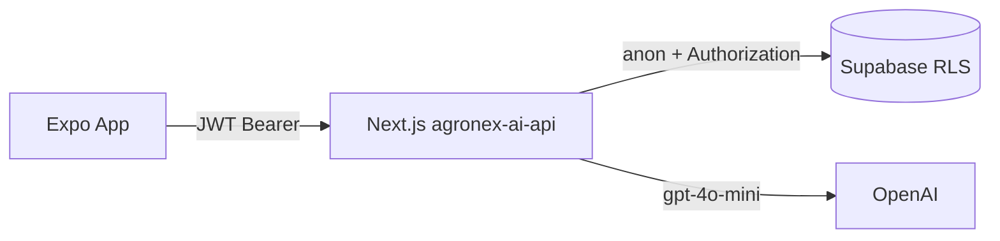

# AI Platform Deploy Guide

This guide deploys the AgroNex AI API (`apps/agronex-ai-api`) with:
- **Vercel** for Next.js API hosting
- **Railway** as an optional alternative runtime

## 1) Prerequisites

- Supabase project configured
- Existing schema applied from `supabase/schema.sql`
- AI schema applied from `supabase/ai_schema.sql`
- OpenAI API key

## 2) Environment Variables

Set these in your deployment platform:

- `NEXT_PUBLIC_SUPABASE_URL`
- `NEXT_PUBLIC_SUPABASE_ANON_KEY`
- `SUPABASE_SERVICE_ROLE_KEY`
- `OPENAI_API_KEY`

## 3) Deploy on Vercel

1. Import repository into Vercel.
2. Set root directory to `apps/agronex-ai-api`.
3. Framework preset: Next.js.
4. Add all environment variables.
5. Deploy.
6. Validate:
   - `GET https://<vercel-domain>/api/health`

## 4) Deploy on Railway (Alternative)

1. Create new Railway service from GitHub repository.
2. Set service root to `apps/agronex-ai-api`.
3. Build command: `npm install && npm run build`
4. Start command: `npm run start`
5. Add environment variables listed above.
6. Deploy and validate `/api/health`.

## 5) Expo Mobile Configuration

Set in Expo `.env`:

`EXPO_PUBLIC_AI_API_URL=https://<your-deployed-api-domain>`

The mobile app sends Supabase JWT bearer tokens to AI routes.

## 6) Security Notes

- Keep `OPENAI_API_KEY` server-side only.
- Keep `SUPABASE_SERVICE_ROLE_KEY` server-side only.
- All business data fetches should use user JWT via Supabase anon client + RLS.
- Do not expose raw OpenAI calls in mobile code.
# AgroNex AI Platform — Despliegue

## Arquitectura



**Regla de seguridad:** OpenAI solo en backend. Expo nunca recibe `OPENAI_API_KEY`.

---

## 1. SQL (Supabase)

Ejecutar en SQL Editor **después** de `schema.sql`:

```bash
supabase/ai_schema.sql
```

No modifica tablas `clients`, `farms`, `flights`, `agrochemicals`, `expenses` ni sus políticas RLS.

---

## 2. Variables de entorno

### Backend (`apps/agronex-ai-api/.env.local`)

| Variable | Requerida | Descripción |
|----------|-----------|-------------|
| `SUPABASE_URL` | Sí | URL del proyecto Supabase |
| `SUPABASE_ANON_KEY` | Sí | Anon/publishable key |
| `OPENAI_API_KEY` | Sí | Clave OpenAI (solo servidor) |
| `SUPABASE_SERVICE_ROLE_KEY` | No | Solo tareas admin opcionales |

### Expo (`.env.local` raíz)

| Variable | Requerida | Descripción |
|----------|-----------|-------------|
| `EXPO_PUBLIC_SUPABASE_URL` | Sí | Ya existente |
| `EXPO_PUBLIC_SUPABASE_ANON_KEY` | Sí | Ya existente |
| `EXPO_PUBLIC_AI_API_URL` | Sí | URL pública del API Next.js |

---

## 3. Dependencias npm

### Raíz Expo (ya incluidas)

- `expo-image-picker` — OCR desde galería
- `@tanstack/react-query` — hooks AI
- `@supabase/supabase-js` — JWT para API

### Backend `apps/agronex-ai-api`

```bash
cd apps/agronex-ai-api
npm install
```

Paquetes: `next`, `openai`, `@supabase/supabase-js`, `jspdf`, `zod`, `react`, `react-dom`.

---

## 4. Desarrollo local

```bash
# Terminal 1 — API
cd apps/agronex-ai-api
cp .env.example .env.local
npm run dev

# Terminal 2 — Expo
cd ../..
# .env.local → EXPO_PUBLIC_AI_API_URL=http://localhost:3000
npm start
```

---

## 5. Despliegue Vercel (recomendado para Next.js)

1. Crear proyecto en [vercel.com](https://vercel.com) conectado al repo.
2. **Root Directory:** `apps/agronex-ai-api`
3. **Framework Preset:** Next.js
4. **Build Command:** `npm run build`
5. **Output:** default Next.js
6. Variables de entorno en Vercel:
   - `SUPABASE_URL`
   - `SUPABASE_ANON_KEY`
   - `OPENAI_API_KEY`
7. Deploy → copiar URL (ej. `https://agronex-ai-api.vercel.app`)
8. En Expo/EAS:
   ```
   EXPO_PUBLIC_AI_API_URL=https://agronex-ai-api.vercel.app
   ```

**CLI alternativa:**

```bash
cd apps/agronex-ai-api
npx vercel login
npx vercel --prod
```

---

## 6. Despliegue Railway

1. Crear proyecto en [railway.app](https://railway.app)
2. **New Project → Deploy from GitHub repo**
3. **Root directory:** `apps/agronex-ai-api`
4. **Start command:** `npm run start`
5. **Build command:** `npm install && npm run build`
6. Variables:
   - `SUPABASE_URL`
   - `SUPABASE_ANON_KEY`
   - `OPENAI_API_KEY`
   - `PORT=3000` (Railway inyecta `PORT` automáticamente; Next.js `start -p $PORT` si se ajusta script)
7. Generar dominio público → usar como `EXPO_PUBLIC_AI_API_URL`

**package.json start para Railway (opcional):**

```json
"start": "next start -p ${PORT:-3000}"
```

---

## 7. Endpoints

| Método | Ruta | Función |
|--------|------|---------|
| POST | `/api/ai/chat` | Chat contextual |
| GET/POST | `/api/ai/reports` | Listar / generar reportes |
| GET | `/api/ai/reports/[id]/pdf` | Export PDF |
| POST | `/api/ai/anomalies` | Detectar alertas |
| POST | `/api/ai/predictions` | Predicciones |
| POST | `/api/ai/ocr` | OCR → expenses |
| GET | `/api/ai/dashboard` | Widgets dashboard |
| GET | `/api/health` | Health check |

Todas requieren header: `Authorization: Bearer <supabase_access_token>`.

---

## 8. Costos OpenAI (referencia)

| Tier | Usuarios/mes | Rango USD/mes |
|------|--------------|---------------|
| MVP | 50–200 | 80 – 450 |
| Enterprise | 1000+ | 2,500 – 15,000+ |

Modelo base: `gpt-4o-mini` (chat, reportes, OCR visión).

---

## 9. MVP vs Enterprise

| MVP | Enterprise |
|-----|------------|
| Chat + dashboard + reportes PDF | Colas async + cuotas por tenant |
| Anomalías heurísticas | Modelos ML calibrados |
| OCR manual desde app | OCR batch + storage dedicado |
| JWT + RLS | Observabilidad + auditoría AI |
